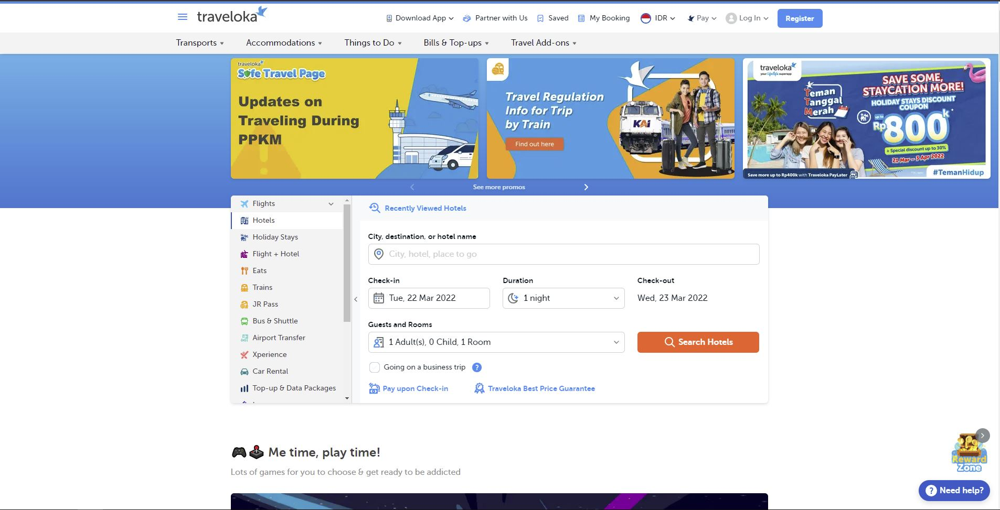
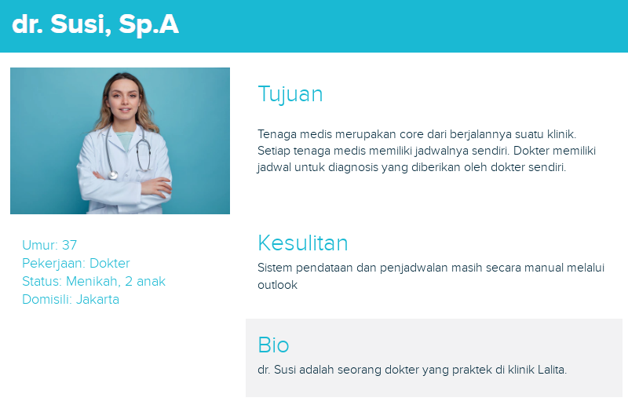

# Persona

### Apa itu persona?

Di dalam dunia desain, persona adalah sebuah karakter atau tokoh 'semi-imajiner' yang dapat membantu kita dalam merancang sebuah aplikasi. Mengapa saya sebut semi-imajiner? Karena pada dasarnya, tokoh yang kita jadikan sebagai persona tidak ada di dunia nyata, alias karakter fiktif. Tetapi, karakter fiktif tersebut harus dapat menggambarkan atau merepresentasikan seseorang di dunia nyata.

### Apa saja elemen dari sebuah persona?

Setiap persona tentu akan berbeda formatnya, tergantung dari siapa yang membuat persona tersebut. Tetapi, ada beberapa elemen utama yang setidaknya hadir di sebuah persona. Beberapa di antaranya antara lain:

- **Nama**: Nama, walaupun terkesan sederhana dan kurang penting, justru memiliki kegunaan yang tidak kalah penting. Dengan memberikan nama kepada persona kita, persona yang kita buat akan terkesan lebih hidup dan nyata. Dengan demikian, kita bisa mendapatkan gambaran yang lebih dalam terhadap persona yang kita buat ini.

- **Foto**: Dengan alasan yang sama seperti nama, foto persona juga tidak kalah penting agar kita bisa lebih mudah lagi dalam mengimajinasikan persona kita.

- **Data demografis**: Data demografis biasanya meliputi informasi-informasi umum seperti umur, pekerjaan, domisili, dan sebagainya. Data demografis juga dapat membantu kita dalam mengimajinasikan karakter persona kita.

- **Bio**: Biografi singkat merupakan beberapa kalimat yang menggambarkan siapa persona yang kita buat ini. Tingkat detilnya tidak harus setara dengan biografi sungguhan, tetapi cukup untuk mendeskripsikan karakter dari persona yang kita buat. Terkadang 2 paragraf sudah cukup untuk dijadikan batas minimal panjang biografi singkat ini.

- **Kebutuhan dan keinginan**: Tentunya setiap orang memiliki kebutuhan dan juga keinginan, yang artinya persona juga membutuhkannya. Kita bisa mendaftarkan ataupun menguraikan apa saja yang diinginkan dan dibutuhkan oleh persona kita ini. Biasanya, apa yang kita tulis di sini sudah mulai dihubungkan dengan aplikasi yang akan kita kembangkan. Dalam kata lain, kebutuhan dan keinginan yang kita tulis sudah menggunakan konteks aplikasi yang akan kita kembangkan.

- **Kesulitan**: Tidak semua orang memiliki hidup yang lancar dan indah, pasti ada saja rintangan dan kesulitan yang dihadapi, tidak terkecuali persona. Di sini kita harus menuliskan apa saja kesulitan yang dialami dan dilalui oleh persona kita. Usahakan, kesulitan yang ditulis juga sudah berhubungan dengan aplikasi yang kita akan kembangkan.

- **Harapan**:  Pada bagian ini, kita harus menulis apa harapan dari persona ketika menggunakan apliaksi yang kita akan kembangkan. Tentunya, sebagai pengembang aplikasi yang baik, kita harus bisa memenuhi harapan-harapan persona yang kita buat ini nantinya.

> Contoh persona

### Apa manfaat dari persona?

Lalu mengapa kita harus membuat sebuah persona ketika mendesain aplikasi? Ini karena persona dapat membantu kita dengan memberikan gambaran kasar tentang pengguna aplikasi kita yang sebenarnya nanti. Dengan bantuan persona, kita bisa 'berimajinasi' kira-kira kalau persona tersebut melihat dan menggunakan aplikasi yang sedang kita kembangkan, apa reaksi, pikiran, dan tindakan yang akan dilakukan oleh persona tersebut. Apakah sudah sesuai dengan apa yang kita inginkan? Kalau misal belum, lantas kita bisa memikirkan apa yang harus dilakukan agar sesuai dengan keinginan kita.

Misalnya, sebagai contoh, kita adalah seorang pengembang perangkat lunak dari [Traveloka](https://www.traveloka.com/en-id/) dan kita menggunakan persona Jill Anderson seperti gambar di atas untuk membantu kita dalam merancang aplikasi Traveloka.

Dari data demografis Jill, kita bisa melihat kalau Jill berada di rentang usia 30-an dan sudah menikah dan memiliki anak. Pada umumnya, orang-orang seperti Jill tidak terlalu ingin mengeksplorasi aplikasi untuk mencari fitur yang dia butuhkan. Jill juga merupakan seseorang yang sering menggunakan pesawat terbang. Kalau melihat dari halaman Traveloka, kita bisa lihat kalau halaman Traveloka sudah memenuhi apa yang kira-kira Jill inginkan. Ada satu *window*  yang menampilkan fitur-fitur pemesanan seperti hotel dan penerbangan. Terlelbih lagi, fitur yang sering diakses seperti hotel dan penerbangan sudah diletakkan di daftar urutan paling atas sehingga mudah dicari. 

Kalau kita lihat biografi, *goals*, dan *frustrations* milik Jill, kita tahu kalau Jill perlu aplikasi yang dapat memesan tiket penerbangan dan hotel dengan mudah, cepat, dan praktis. Jill ingin agar dia bisa memesan ulang tiket pesawat dan booking hotel yang sama dengan yang dia pernah pesan sebelumnya. Dia juga ingin agar dia bisa melakukan semua pemesanan dan booking menggunakan satu website yang sama. Hal-hal tersebut sudah berhasil dipenuhi oleh Traveloka. Bisa kita lihat Traveloka sudah menyediakan fitur Saved yang bisa kita gunakan untuk memesan ulang pemesanan yang sudah pernah kita pesan sebelumnya. Di Traveloka kita juga bisa melakukan berbagai macam booking dan pemesanan sekaligus di dalam satu aplikasi yang sama.

Maka dengan ini, kita bisa menyatakan bahwa kebutuhan dari persona Jill Anderson sudah terpenuhi oleh Traveloka. Sekarang, semua orang yang memiliki latar belakang dan kepribadian seperti Jill akan merasa nyaman dan betah menggunakan Traveloka karena sudah sesuai dengan keinginan dan kebutuhan mereka. Kalau kita mengasumsikan persona Jill Anderson ini merupakan persentase yang besar dari pengunjung dan pengguna Traveloka, maka Traveloka akan semakin sukses lagi. Inilah juga mengapa pemilihan siapa persona yang ingin kita buat juga penting, karena persona yang kita buat juga harus bersifat representatif dari seluruh pengguna dan pengunjung aplikasi.

Kalau misalnya ada fitur pada aplikasi Traveloka yang belum atau tidak memenuhi kebutuhan atau keinginan dari persona yang dibuat, maka akan langsung terlihat kalau ada yang dapat diperbaiki dari hasil evaluasi persona. Misalnya kita anggap saja fitur Saved tidak hadir pada aplikasi Traveloka. Hal ini akan membuat keinginan Jill yang ingin memesan pemesanan yang pernah dipesan sebelumnya belum terpenuhi. Dari sini kita bisa memikirkan kira-kira solusi apa yang bisa dilakukan untuk memenuhi kebutuhan Jill tersebut. Dengan demikian, aplikasi yang kita buat akan dapat memenuhi kebutuhan dan keinginan pengguna aplikasi kita nanti.

### Perancangan persona untuk aplikasi kami

Aplikasi yang sedang kami kembangkan memiliki 4 persona. Ada tenaga medis, staff administasi, klinik, pemilik klinik, dan pasien itu sendiri. Masing-masing persona memiliki nama, data demografis, bio, tujuan, dan juga kesulitan. Dengan adanya keempat persona tersebut, ketika sedang merancang aplikasi, kami dapat membayangkan dam berimajinasi bagaimana persona-persona tersebut berinteraksi dengan aplikasi kami. Dari bayangan dan imajinasi tersebut, kami bisa menilai apakah desain aplikasi kami sudah sesuai atau belum. Jika sudah ada desain yang sesuai, maka hal tersebut harus dipertahankan, dan kalau ada desain yang belum sesuai, kami akan melakukan perbaikan sedemikian sehingga desain tersebut sudah sesuai. Harapannya, dengan adanya dan digunakannya persona ini, aplikasi kami nantinya akan diterima dan digunakan dengan mudah oleh pengguna yang sebenarnya. 

  

> Persona dr. Susi Sp.A merupakan salah satu persona yang kami buat dan gunakan
