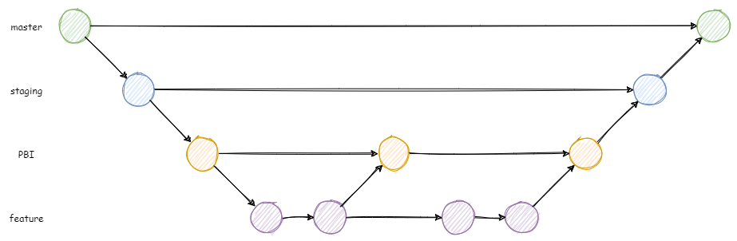

# Git

### Apa itu Git?

Git adalah salah satu program yang banyak digunakan oleh berbagai macam developer dari seluruh dunia yang berfungsi untuk mencatat perubahan *codebase* dari suatu *code  repository*. Pada dasarnya, cara kerja Git mirip dengan misalnya Google Drive atau misalnya Dropbox. Misalnya kita ingin menyimpan *codebase* kita. Kita bisa saja melakukan upload *codebase* kita ke Google Drive atau Dropbox. Lalu nanti ketika ada perubahan di dalam *codebase* kita, kita bisa melakukan upload ulang. Ya benar, hal tersebut memang merepotkan. Oleh karena itu kita menggunakan Git. Git akan dengan mudah mendeteksi perubahan di dalam *codebase*. Proses mengunggahnya juga mudah, hanya dengan menjalankan command beberapa baris saja. Selain itu, Git juga lebih dari sekedar menyimpan saja, Git juga punya banyak sekali tools yang dapat membantu developer dalam mengembangkan perangkat lunak.

> Linus Torvalds, mencipta Git. Sumber: [tirto.id](https://tirto.id/linus-torvalds-dan-linux-simbol-perlawanan-terhadap-microsoft-cACd).

### Bagaimana cara Git bekerja?

Kalau kita ingin menggunakan Git untuk mengatur repository kita, bisa melakukan perintah `git init` untuk menginisialisasi repository kita. Lalu kita bisa melakukan `git add` untuk menambah file yang akan disimpan. Setelah file yang ingin disimpan sudah di-add semua, kita bisa melakukan `git commit` untuk memfinalisasi penambahan/perubahan file. Kemudian kita bisa memanfaatkan layanan seperti [GitLab](https://about.gitlab.com/) atau [GitHub](https://github.com/) untuk menyimpan repository kita di internet dengan menggunakan bantuan perintah `git push`.

Tetapi asal add, commit, dan push saja bukanlah merupakan *good practice*. Kita harus memanfaatkan Git agar *codebase* kita mudah di-*maintain*. Hal ini dapat dicapai dengan menerapkan Git Flow yang baik.

### Git Flow yang baik itu seperti apa?

Git juga mempunyai salah satu fitur yang tidak kalah penting yaitu branching. Branching ini akan membuat perubahan dan progres development berjalan dengan lebih lancar. Mekanisme branching tentunya akan berbeda dari setiap proyek, tetapi ada konvesi khusus yang dianggap best practice. Setidaknya, kita membutuhkan 3 branch utama. Ada master branch, yang akan berisi software yang sudah jadi dan bisa digunakan, ada staging branch, branch yang paling dekat dengan master di mana perubahan baru akan dikumpulkan terlebih dahulu dan diperiksa apakah sudah layak untuk dimasukkan ke dalam master branch, dan terakhir adalah beberapa feature branch, di mana masing-masing fitur dikembangkan pada branch yang bersesuaian. Nantinya semua feature branch akan dimasukkan ke dalam staging branch, baru kemudian dimasukkan ke dalam master branch.

Ada juga branch khusus seperti hotfix branch dan juga coldfix branch. Hotfix akan berisi berubahan yang membenarkan error yang terjadi di master branch. Sedangkan coldfix adalah branch yang digunakan untuk menghapus fitur-fitur dari staging branch yang dinilai harus dihapus.

### Penerapan Git Flow di proyek kami

Proyek kami selalu menerapkan Git Flow yang baik semaksimal mungkin. Kami memiliki master branch yang hanya berisi *working software* dan staging branch yang berisi perubahan-perubahan yang akan dimasukkan ke dalam master branch untuk setiap *release*. Kami juga menggunakan feature branch yang kami namai PBI branch yang berisi perubahan-perubahan yang sesuai dengan PBI yang bersesuaian. Karena masing-masing PBI memiliki beberapa fitur masing-masing, kami membuat branch satu lagi dari PBI branch sesuai dengan fitur-fitur dari PBI branch tersebut.

Nantinya, setelah fitur untuk suatu PBI selesai dibuat, kita akan membuat Merge Request untuk memasukkan perubahan tersebut dari branchnya ke PBI branch. Tetapi sebelum dilakukan merge itu sendiri, kita harus meminta *code review* dari rekan kelompok kami untuk memastikan bahwa perubahan yang akan dimasukkan sudah benar dan sesuai. Setelah semua fitur-fitur untuk suatu PBI branch dimasukkan ke dalam PBI branch itu sendiri, maka kita akan lanjutkan dengan membaut merge request dari PBI branch ke staging branch. Tetntunya proses *code review* di sini harus tetap dilakukan, bahkan jumlah anggota yang melakukan *code review* harus lebih banyak dari pada saat merge ke PBI branch. Setelah semua branch PBI dimerge ke staging, kita akan membuat merge request dari staging ke master yang nantinya akan diotorisasi oleh dosen dan asods.

> Ilustrasi Git Flow dan Branching di dalam proyek kelompok kami
