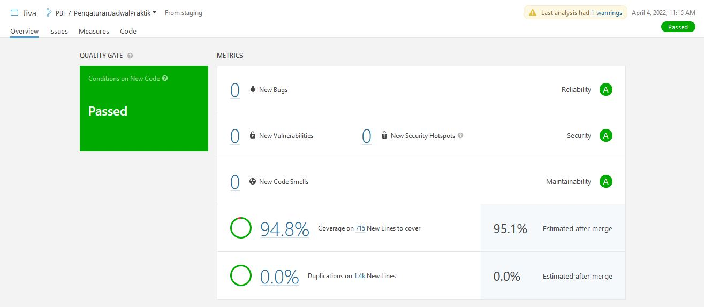

# Software Quality Assurance (SQA)

### Apa itu SQA?

Software Quality Assurance (SQA) adalah aspek dari progam yang mencakup kualitas dari progam. Progam yang kita buat tentunya harus memiliki kualitas yang tinggi dan maksimal. Tentunya kita tidak mungkin akan menyajikan dan memberikan program dengan kualitas yang buruk kepada user. Kita juga tentunya harus memberikan program dengan kualitas yang tinggi agar proses pengembangan dapat berjalan lancar seiring berjalannya waktu. Tetapi mengukur kualitas program secara manual tentunya akan melelahkan dan rawan ada yang terlewat. Oleh karena itu kita dapat menggunakan bantuan beberapa program untuk melakukan penilaian kualitas program secara otomatis. Beberapa contoh program yang dapat menilai SQA antara lain adalah seperti [Sonarqube](https://www.sonarqube.org/) dan [Sonarcloud](https://sonarcloud.io/).

### Apa saja yang dinilai untuk SQA

1. Reliability

    Aspek reliability yang diukur biasanya mencakup *bugs* pada program. SQA software mempunyai kemampuan untuk mendeteksi adanya *bugs* di dalam program yang di-scan. Tentunya kita harus memastikan bahwa progam yang kita buat *bug*-free. Karena siapa yang ingin menggunakan program yang mempunyai *bugs*? Tentunya semua orang menginginkan program yang bebas dari *bugs*. Oleh karena itu, SQA software akan menunjukkan ada berapa banyak *bugs* beserta lokasinya pada program.

2. Security 

    Program yang kita buat harus aman. Data tidak boleh bocor dan tidak boleh ada orang yang tidak terotorisasi yang dapat masuk ke dalam sistem. Inilah mengapa SQA software akan menunjukkan bagian-bagian mana program kita terdeteksi rawan dan rentan memiliki tingkat keamanan yang rendah. Dengan mengetahui di mana bagian yang rentan, kita bias langsung melakukan perbaikan pada bagian tersebut agar program yang kita buat dapat memiliki tingkat keamanan yang lebih tinggi.

3. Maintainability

    Code smells adalah salah satu penghambat proses pengembangan. Code smells memang tidak berpengaruh besar bagi user. Tetapi, code smells dapat menumpuk dengan cepat kalau kita tidak berhati-hati. Kalau code smell kita terlalu banyak, program yang kita buat bisa akan sulit untuk di-*maintain*. Oleh karena itu, code smell harus diatasi. SQA software bahkan tidak hanya menunjukkan ada berapa banyak titik code smell yang ada di program kita, tetapi SQA software juga dapat mengkalkulasi kira-kira kita akan butuh waktu berapa lama untuk menghilangkan code smell tersebut. Kalau kita tidak atasi dengan cepat, jangan kaget kalau nanti waktu yang dibutuhkan untuk mengurus semua code smell bisa sampai berjam-jam.

4. Coverage

    Coverage akan munjukan sebarapa banyak bagian prorgam yang sudah di-*cover* dengan testing. Semakin tinggi nilai coverage, maka program kita akan semakin aman dari error akibat perubahan. Karena kalau dikemudian hari dilakukan perubahan yang salah, test-nya akan error. Kalau coverage yang kita miliki itu rendah, maka ditakutkan ada bagian program yang jika diubah dan ubahannya salah, akan menyebabkan hal-hal yang tidak diinginkan. SQA software tidak hanya akan menunjukkan persentasi coverage, teatpi juga akan menunjukan bagian program mana yang belum di-*cover* oleh test sehingga kita bisa langsung fokus untuk membauat test untuk bagian tersebut.

5. Duplications

    Penerapan clean code yang baik merupakan salah satu ciri dari program dengan kualitas yang baik. Kalau kita ingat lagi, salah satu aspek dari clean code adalah jangan sampai ada bagian program yang terduplikasi. SQA software tenunya akan membantu kita dalam mendeteksi duplikasi di dalam program. SQA juga akan menampilkan berapa persentasi duplikasi dari program yang kita buat. Dengan bantuan SQA ini, kita bisa langusng mengatasi duplikasi kode agar program yang kita buat bisa memiliki kualitas yang lebih baik lagi dan juga lebih 'clean' sesuai dengan aspek-aspek clean code.

### Penerapan SQA di proyek kami

Kami menggunakan bantuan Sonarqube untuk memeriksa kualitas dari progam yang kami buat. Sonarqube akan melakukan scan untuk branch-branch tertentu seperti branch master, staging, dan PBI. Scan tersebut akan berjalan otomatis setiap kali ada merge request yang bersesuaian dengan bentuan GitLab CI. Dari hasi scan tersebut, kita bisa melihat berbagai telemetri dari program yang baru saja di-scan tersebut. Kita bisa melihat apakah ada bugs, apakah ada titik keamanan yang rawan, dan apakah program kita terhindar dari codesmells, dan kalaupun ada, kira-kira berapa waktu yang dibutuhkan untuk menghilangkan code smell tersebut. Sonarqube juga akan memeriksa coverage dari test yang kita buat. Selain itu, sonarqube juga bisa menunjukan seberapa banyak baris kode yang mengalami duplikasi.

> Hasil Sonar Scan untuk branch `PBI-7-PengaturanJadwalPraktik`
