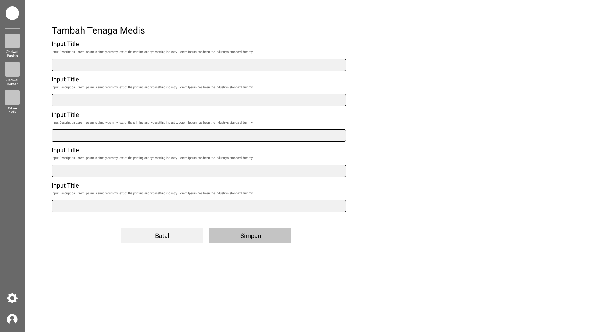
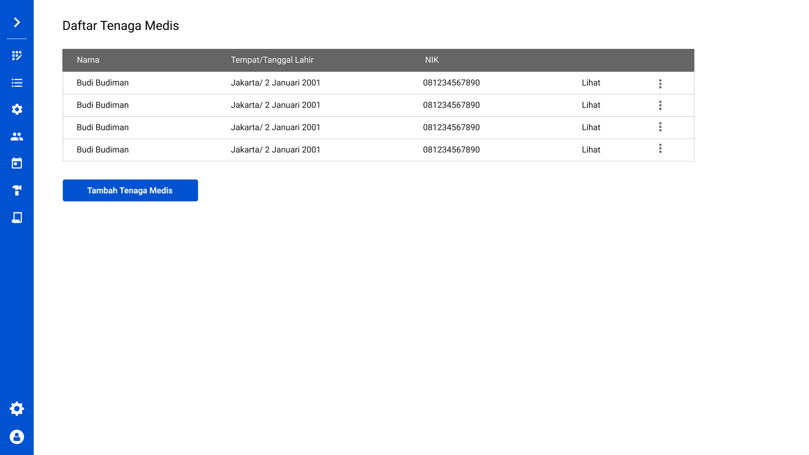
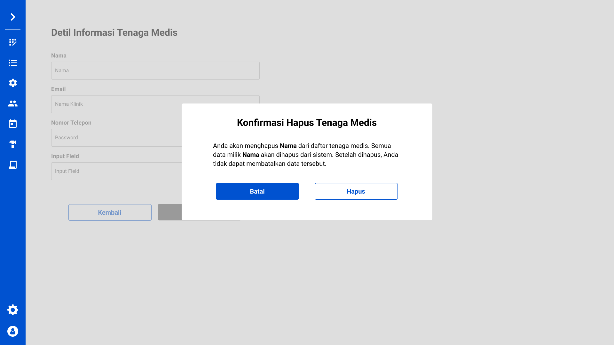

# Visual Design

### Seperti apa Visual Design yang bagus?

Seperti yang sudah kita duga, pertanyaan tersebut tidak memiliki jawaban yang pasti. Jawaban dari pertanyaan tersebut akan bersifat subjektif. Walaupun begitu, terkadang ada beberapa pola-pola yang terbentuk yang dapat kita temukan di desain yang memiliki *visual design* yang bagus. Tentunya pola-pola tersebut tidak berimplikasi pada *visual design* yang bagus, tetapi dengan adanya pola-pola tersebut, kita bisa meningkatkan aspek *visual design* kita menjadi lebih baik lagi. 

Selain pola-pola tersebut, kita juga dapat menerapkan beberapa proses desain yang bisa menghasilkan aspek *visual design* yang bagus. Proses ini tentu tidak ada "panduan" pastinya. Untuk setiap desain, pasti memiliki prosesnya sendiri yang unik, yang mungkin bagus untuk diterapkan pada desain tersebut namun tidak untuk desain yang lain; ataupun sebaliknya.

### Pola-pola seperti apa yang bisa meningkatkan Visual Design?

Salah satu pola yang bisa meningkatkan aspek *visual design* adalah **Nielsen’s 10 Usability Heuristics**. Nielsen’s Usability Heuristics tersebut antara lain:

1. Visibility of system status

    Desain sistem yang kita rancang harus dapat menginformasikan kondisi sistem kepada pengguna. Tetapi tidak sekedar memberikan informasi saja, informasi tersebut harus disampaikan secepat mungkin. Dengan melakukan ini, pengguna bisa tahu apa akibat dari tindakan-tindakan mereka sehingga mereka tahu apa yang harus dilakukan selanjutnya.

2. Match between system and the real world

    Desain yang kita rancang harus sesuai dengan "dunia" pengguna. Kita harus memilih unsur-unsur desain, seperti tulisan dan gambar, yang sudah umum untuk digunakan oleh pengguna. Ketika kita mendesain sebuah sistem yang sudah "akrab" dengan pengguna, pengguna bisa mendapatkan gambaran dari cara menggunakan sistem dengan jelas dan cepat. Terkadang kita suka langsung menggunakan "bahasa" kita sendiri ketika mendesain sebuah sistem, tetapi kita perlu ingat lagi bahwa yang akan menggunakan sistem tersebut adalah pengguna, bukan kita.

3. User control and freedom

    Kita harus mendesain sistem yang dapat mebatalkan tindakan yang tidak diinginkan atau yang tidak disengaja oleh pengguna. Dengan begitu, pengguna akan merasa aman ketika menggunakan sistem kita, karena kalau mereka membuat kesalahan, tidak akan ada akibat yang fatal. Bahkan tidak ada akibatnya sama sekali.

4. Consistency and standards

    Sistem yang kita desain harus memiliki desain yang konsisten. Semua aspek di dalam kita harus konsisten di setiap bagian. Jika suatu tulisan pada suatu halaman memiliki suatu arti tertentu, pastikan bahwa di halaman lain tulisan tersebut memiliki arti yang sama. Dengan memiliki konsistensi, pengguna juga dapat mempelajari sistem dengan nyaman karena tidak ada aspek yang berubah-ubah. Biasanya, untuk menjaga konsistensi, kita harus menyiapkan *guidelines* dalam desain kita.

5. Error prevention

    "Mencegah lebih baik daripada mengobati". Isitlah tersebut sangat menggambarkan *usability heuristic* ini. Sebelum pengguna dapat membuat kesalahan atau berbuat sesuatu yang dapat mengakibatkan perubahan yang besar, informasikan hal tersebut kepada pengguna. Dengan begitu, jika memang pengguna tidak berniat untuk melakukan tindakan tersebut, pengguna bisa mencegah hal-hal yang tidak diinginkan tersebut agar tidak terjadi.

6. Recognition rather than recall

    Ketika mendesain sistem, kita harus membuat sistem yang *carefree*. Kita harus membuat aspek-aspek desain kita mudah untuk dikenali, jangan hanya sekedar mudah diingat. Meminta pengguna untuk mengingat suatu aspek dari sistem kita akan membuat pengguna tidak nyaman. Akan lebih baik jika aspek desain yang kita rancang mudah untuk dikenali oleh pengguna sehingga pengguna juga bisa merasa nyaman ketika menggunakan sistem kita.

7. Flexibility and efficiency of use

    Sistem yang kita buat harus *robust*. Sistem harus mudah untuk digunakan dan dipelajari oleh pengguna baru tetapi nyaman dan memuaskan untuk pengguna yang sudah lama dan biasa. Oleh karena itu, kita bisa membuat fitur-fitur khusus untuk pengguna yang memang ingin menggunakannya (biasanya pengguna lama yang sudah biasa menggunakan sistem kita). Fitur-fitur tersebut bisa berupa *shortcuts*, *customization*, dan sebagainya.

8. Aesthetic and minimalist design

    Tampilan antarmuka dari sistem yang kita desain harus seminimal mungkin. Jangan memberikan informasi-informasi yang tidak terlalu penting dan jarang diperhatikan pengguna. Tampilkan yang perlu-perlu saja secukupnya. Dengan demikian, pengguna dapat lebih fokus dengan apa yang mereka ingin lakukan karena tidak ada terlalu banyak "*noise*" yang mengganggu mereka.

9. Help users recognize, diagnose, and recover from errors

    Ketika pengguna menemui error pada sistem, kita harus menyampaikan hal tersebut ke pengguna dengan bahasa yang sesuai. Jangan menggunakan bahasa-bahasa yang terlalu teknis yang tidak dimengerti oleh pengguna. Ini termasuk *error code* mentah dari sistem yang sudah pasti dilarang keras untuk ditampilkan karena tidak *user friendly*. Selain menyampaikan error, kita juga harus memberikan panduan solusi untuk mengatasi error tersebut kepada pengguna.

10. Help and documentation

    Sebagai pelengkap yang tidak kalah penting, kita juga harus menyediakan informasi lengkap terkait sistem yang kita desain. Segala macam panduan untuk melakukan berbagai *task* harus kita sediakan. Kita juga harus memastikan bahwa informasi dan panduan ini dapat dicari dengan mudah ketika pengguna menginginkannya. Selain itu, informasi dan panduan yang kita tulis juga harus disampaikan secara singkat, padat, dan jelas.

### Proses desain seperti apa yang bisa meningkatkan Visual Design?

Sebelum mulai membuat sistem, kita harus mendesain sistem kita terlebih dahulu. Salah satu konsep proses desain yang cukup terkenal adalah **Wireframing and Prototyping**.

- Wireframe

    Wireframe adalah gambaran rangka desain dari sistem yang kita rancang. Tujuan dari pembuatan wireframe adalah agar kita tahu informasi apa saja yang ingin kita tampilkan pada sistem yang sedang kita desain. Oleh karena itu, biasanya wireframe tidak memiliki tampilan yang bagus, hanya berupa "kawat-kawat (*wire*)" rangka saja.

- Prototype

    Setelah kita puas dengan wireframe kita, kita bisa mulai membuat prototype. Prototype adalah iterasi selanjutnya dari wireframe. Prototype adalah wireframe yang sudah kita berikan tampilan desain. Tujuan dari pembuatan prototype adalah agar kita tahu seperti apa tampilan asli sistem yang sedang kita desain tersebut. Prototype juga bisa dibuat *clickable* sehingga kita bisa mendapatkan gambaran yang lebih jelas lagi tentang sistem kita. Oleh karena itu, terkadang prototype sering dikira sebagai *finished product*-nya.

### Apa yang dilakan oleh kelompok kamu untuk meningkatkan Visual Design?

Untuk meningkatkan aspek visual design dari sistem aplikasi yang kami buat, kami melakukan *wireframing* dan *prototyping* terlebih dahulu sebelum masuk ke proses penulisan *source code*. Prototype dan wireframe yang kami buat juga tidak hanya satu. Kami membuat beberapa versi wireframe dan prototype dan dari semua wireframe dan prototype tersebut kami melakukan seleksi mana wireframe dan prototype yang terbaik.

Wireframe dan prototype yang kami buat juga mengikuti Nielsen’s 10 Usability Heuristics. Salah satunya adalah usability heuristic "**Match between system and the real world**". Label-label dan gambar yang kami gunakan kami sesuaikan dengan pengguna kami yaitu tenaga medis dan staff rumah sakit Indoneisa. Oleh karena itu kami menggunakan kosa kata Bahasa Indonesia yang sudah pasti dipahami oleh tenaga medis dan staff rumah sakit di Indonesia. Selain itu kami juga menerapkan usability heuristic "**Error prevention**". Kami menyembunyikan tombol "Hapus" agar tidak bisa tidak sengaja di-klik. Selain itu, kalaupun pengguna menekan tombol "Hapus", akan ada peringatan terlebih dahulu sebelum data terhapus. Bahkan, kami menerapkan *soft delete* sehingga data-data yang dihapus di dalam sistem tidak akan benar-benar terhapus dari sistem.

> Wireframe halaman Dashboard Tenaga Medis

> Prototype halaman Dashboard Tenaga Medis

> Penerapan usability heuristic "**Error prevention**"
